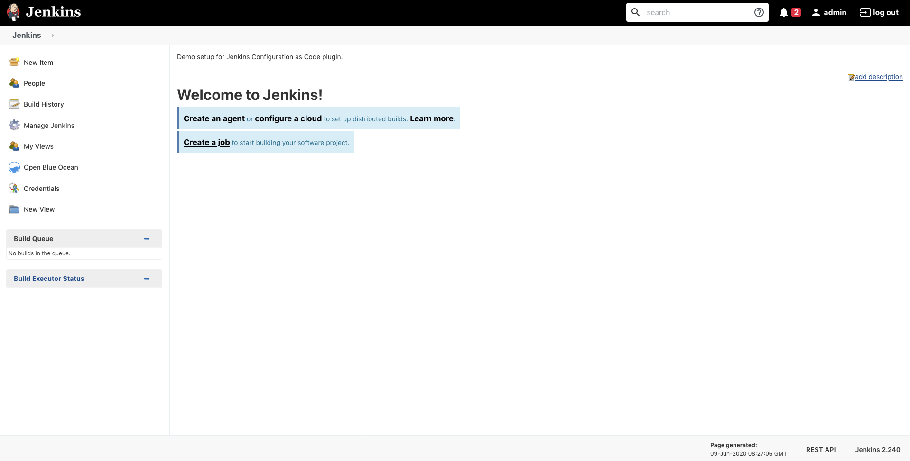

# docker-jcasc




Quickstart

`make build`

`make up`

open: http://127.0.0.1:8080/

Login: admin/admin

Docker hub image: https://hub.docker.com/r/p0bailey/docker-jcasc

```
build                          Build docker image!
up                             Run
stop                           Stop services
logs                           Show container logs
restart                        Restart services.
rebuild                        Rebuild a clean environment.
clean                          Delete everything.
shell                          Get a shell into the container.
```

Add your Jcasc configuration to casc_configs/jenkins.yaml 

Official examples: https://github.com/jenkinsci/configuration-as-code-plugin/tree/master/demos
